# Concurrent Evaluation Submission Handling in Project Phoenix

## Overview

This document provides a comprehensive analysis of how the Project Phoenix system handles concurrent evaluation submissions using MongoDB's atomic operations and transaction isolation to prevent race conditions and ensure data integrity.

## Problem Statement

When multiple evaluators submit evaluations for the same project simultaneously, the system must:
- ✅ Allow only one evaluation per evaluator
- ✅ Prevent duplicate submissions
- ✅ Maintain data consistency
- ✅ Handle race conditions gracefully
- ✅ Provide clear feedback to users

## Solution Architecture

### Core Components

1. **MongoDB Transactions** - ACID compliance and atomicity
2. **Document-Level Locking** - Prevents concurrent modifications
3. **Conditional Updates** - Race condition prevention
4. **Atomic Operations** - All-or-nothing execution

## Detailed Flow Analysis

### 1. Transaction Setup

```javascript
const session = await mongoose.startSession();
await session.withTransaction(async () => {
  // All operations within this block are atomic
});
```

**Purpose**: Creates an isolated transaction environment where all operations either succeed together or fail together.

### 2. Atomic State Check & Update (Critical Section)

```javascript
const updateResult = await Project.findOneAndUpdate(
  {
    _id: projectId,
    [`${evaluationType}.defenses.evaluators.evaluator`]: evaluatorId,
    [`${evaluationType}.defenses.evaluators.hasEvaluated`]: false // 🔑 Key condition
  },
  {
    $set: {
      [`${evaluationType}.defenses.$.evaluators.$[elem].hasEvaluated`]: true
    }
  },
  {
    arrayFilters: [{ "elem.evaluator": evaluatorId }],
    new: true,
    session: session
  }
);
```

**This is the CRITICAL operation that handles concurrency:**

- **Conditional Query**: Only updates if `hasEvaluated: false`
- **Atomic Update**: Changes state to `hasEvaluated: true`
- **Return Value**: Document if successful, `null` if condition not met

### 3. Duplicate Detection

```javascript
if (!updateResult) {
  throw new AppError("Evaluation already submitted by this evaluator", 409);
}
```

**Purpose**: Immediately reject duplicate submissions with clear error message.

## Comprehensive Flow Diagram

### Overall System Flow

```mermaid
flowchart TD
    Start([Multiple Evaluators Submit Simultaneously]) --> Init[Initialize Transaction Session]
    
    Init --> Atomic{Atomic findOneAndUpdate<br/>hasEvaluated: false → true}
    
    Atomic -->|Winner| Success[✅ Update Successful<br/>Returns Updated Document]
    Atomic -->|Losers| Fail[❌ Update Failed<br/>Returns null]
    
    Success --> Fresh[Work with Fresh Data<br/>from Atomic Update]
    Fail --> Error409[Throw 409 Error<br/>"Already Submitted"]
    
    Fresh --> Conflict{Check for<br/>Evaluation Conflicts}
    
    Conflict -->|No Conflicts| Complete{All Evaluators<br/>Completed?}
    Conflict -->|Conflicts Found| ConflictError[Throw 409 Error<br/>"Conflict Detected"]
    
    Complete -->|Yes| DefenseComplete[Mark Defense Complete<br/>Update Student Progress<br/>Clear Access Codes]
    Complete -->|No| CreateEval[Create Evaluation Record]
    
    DefenseComplete --> CreateEval
    CreateEval --> Commit[Commit Transaction]
    
    Commit --> SuccessResponse[201: Evaluation Submitted Successfully]
    Error409 --> Rollback[Transaction Auto-Rollback]
    ConflictError --> Rollback
    
    Rollback --> ErrorResponse[409: Conflict/Already Submitted]
    
    style Success fill:#90EE90
    style Fail fill:#FFB6C1
    style SuccessResponse fill:#90EE90
    style ErrorResponse fill:#FFB6C1
    style Atomic fill:#87CEEB
```

## Concurrent Submission Detailed Flow

```mermaid
flowchart TD
    subgraph "Concurrent Submissions"
        EA[👤 Evaluator A<br/>Submits Evaluation]
        EB[👤 Evaluator B<br/>Submits Evaluation]
        EC[👤 Evaluator C<br/>Submits Evaluation]
    end
    
    EA --> TX1[Start Transaction A]
    EB --> TX2[Start Transaction B]  
    EC --> TX3[Start Transaction C]
    
    TX1 --> LOCK[🔒 MongoDB Document Lock]
    TX2 --> LOCK
    TX3 --> LOCK
    
    LOCK --> WINNER{Random Lock<br/>Acquisition}
    
    WINNER -->|First| WA[🏆 Evaluator A Wins Lock]
    WINNER -->|Wait| WB[⏳ Evaluator B Waits]
    WINNER -->|Wait| WC[⏳ Evaluator C Waits]
    
    WA --> QA[Query: hasEvaluated = false?]
    QA -->|Match Found| UA[Update: hasEvaluated = true ✅]
    QA -->|No Match| NA[Return null ❌]
    
    UA --> RA[🔓 Release Lock A]
    NA --> RA
    
    RA --> WB2[🔒 Evaluator B Gets Lock]
    WB2 --> QB[Query: hasEvaluated = false?]
    QB -->|No Match<br/>(Already true)| NB[Return null ❌]
    
    NB --> RB[🔓 Release Lock B]
    RB --> WC2[🔒 Evaluator C Gets Lock]
    
    WC2 --> QC[Query: hasEvaluated = false?]
    QC -->|No Match<br/>(Already true)| NC[Return null ❌]
    
    NC --> RC[🔓 Release Lock C]
    
    UA --> PROCEED[Continue Processing<br/>Create Evaluation Record]
    NB --> ERR_B[409 Error: Already Submitted]
    NC --> ERR_C[409 Error: Already Submitted]
    
    PROCEED --> SUCCESS[✅ 201 Success Response]
    ERR_B --> FAIL_B[❌ Error Response B]
    ERR_C --> FAIL_C[❌ Error Response C]
    
    style WA fill:#90EE90
    style SUCCESS fill:#90EE90
    style ERR_B fill:#FFB6C1
    style ERR_C fill:#FFB6C1
    style FAIL_B fill:#FFB6C1
    style FAIL_C fill:#FFB6C1
    style LOCK fill:#87CEEB
```

## MongoDB Document-Level Locking Mechanics

### How MongoDB Serializes Operations

```mermaid
sequenceDiagram
    participant EA as Evaluator A
    participant EB as Evaluator B
    participant EC as Evaluator C
    participant DB as MongoDB
    
    Note over EA,EC: All submit simultaneously
    
    EA->>DB: findOneAndUpdate (hasEvaluated: false)
    EB->>DB: findOneAndUpdate (hasEvaluated: false)
    EC->>DB: findOneAndUpdate (hasEvaluated: false)
    
    Note over DB: Document lock acquired by random winner
    
    DB-->>EA: 🔒 Lock acquired - Execute update
    Note over DB: Others wait for lock release
    
    EA->>DB: Update hasEvaluated: true
    DB-->>EA: Return updated document ✅
    
    Note over DB: 🔓 Lock released
    
    DB-->>EB: 🔒 Lock acquired - Execute update
    EB->>DB: Check hasEvaluated: false (now true)
    DB-->>EB: Return null (no match) ❌
    
    Note over DB: 🔓 Lock released
    
    DB-->>EC: 🔒 Lock acquired - Execute update
    EC->>DB: Check hasEvaluated: false (now true)
    DB-->>EC: Return null (no match) ❌
```



## Race Condition Prevention Strategy

### The "Gate" Mechanism

```javascript
// This condition acts as a one-time gate
{
  _id: projectId,
  [`${evaluationType}.defenses.evaluators.evaluator`]: evaluatorId,
  [`${evaluationType}.defenses.evaluators.hasEvaluated`]: false  // 🚪 The Gate
}
```

### State Transition Diagram

```mermaid
stateDiagram-v2
    [*] --> NotEvaluated: hasEvaluated: false
    
    NotEvaluated --> Evaluating: Multiple evaluators attempt
    
    state Evaluating {
        [*] --> FirstToLock: Random winner gets lock
        FirstToLock --> UpdateState: Condition met (hasEvaluated: false)
        UpdateState --> [*]: hasEvaluated: true
    }
    
    Evaluating --> Evaluated: Winner completes update
    
    state Evaluated {
        note right of SubsequentAttempts: All subsequent attempts fail
        [*] --> SubsequentAttempts: hasEvaluated: true
        SubsequentAttempts --> Rejected: Condition not met
        Rejected --> [*]: Return null
    }
    
    Evaluated --> [*]: Final state
```

## Deterministic vs Non-Deterministic Ordering

### What Determines the Winner?

| Factor | Impact on Ordering | Controllable? |
|--------|-------------------|---------------|
| **Network Latency** | High - First to reach server | ❌ No |
| **Connection Pool** | Medium - Available connections | ❌ No |
| **Thread Scheduling** | Low - MongoDB internal timing | ❌ No |
| **Lock Acquisition** | High - Microsecond differences | ❌ No |

### Why Random is Perfect for Evaluations


## Multiple Evaluator Scenario

### Example: 5 Evaluators Submit Simultaneously

```mermaid
graph TD
    subgraph "Initial State"
        P1[Project: hasEvaluated = false]
    end
    
    subgraph "Concurrent Submissions"
        E1[Evaluator 1]
        E2[Evaluator 2]
        E3[Evaluator 3]
        E4[Evaluator 4]
        E5[Evaluator 5]
    end
    
    E1 --> ML[MongoDB Lock]
    E2 --> ML
    E3 --> ML
    E4 --> ML
    E5 --> ML
    
    ML --> W[Random Winner: E3]
    
    subgraph "Execution Order"
        W --> U1[E3: Update Success ✅]
        U1 --> W2[E1: Gets Lock]
        W2 --> U2[E1: No Match ❌]
        U2 --> W3[E2: Gets Lock]
        W3 --> U3[E2: No Match ❌]
        U3 --> W4[E4: Gets Lock]
        W4 --> U4[E4: No Match ❌]
        U4 --> W5[E5: Gets Lock]
        W5 --> U5[E5: No Match ❌]
    end
    
    subgraph "Final Results"
        R1[E3: 201 Success]
        R2[E1: 409 Already Submitted]
        R3[E2: 409 Already Submitted]
        R4[E4: 409 Already Submitted]
        R5[E5: 409 Already Submitted]
    end
```



## Error Handling Strategy

### Response Codes and Messages

| Scenario | Status Code | Message | Action |
|----------|-------------|---------|--------|
| **First Submission** | `201` | "Evaluation submitted successfully" | Continue processing |
| **Duplicate Submission** | `409` | "Evaluation already submitted by this evaluator" | Reject immediately |
| **Invalid Data** | `400` | "Required credentials missing" | Validation error |
| **System Error** | `500` | "Internal server error" | Log and investigate |

## Performance Characteristics

### Time Complexity
- **Best Case**: O(1) - Single atomic operation
- **Worst Case**: O(n) - Where n is the number of concurrent evaluators
- **Average Case**: O(log n) - Typical lock contention

### Space Complexity
- **Memory Usage**: O(1) per transaction session
- **Document Size**: No significant impact on large documents
- **Lock Duration**: Microseconds to milliseconds

## Real-World Analogy: The Doorway Model

```mermaid
graph LR
    subgraph "Multiple People Approaching"
        P1[Person 1]
        P2[Person 2]
        P3[Person 3]
        P4[Person 4]
    end
    
    P1 --> D[🚪 Single Doorway]
    P2 --> D
    P3 --> D
    P4 --> D
    
    D --> W[Winner Enters ✅]
    D --> L1[Loser 1: Door Closed ❌]
    D --> L2[Loser 2: Door Closed ❌]
    D --> L3[Loser 3: Door Closed ❌]
    
    subgraph "Key Properties"
        K1[Only one can enter]
        K2[Door closes immediately]
        K3[Others are turned away]
        K4[Who enters first is random]
    end
```



## Best Practices and Recommendations

### ✅ Current Implementation Strengths
1. **Atomic Operations** - Leverages MongoDB's built-in concurrency control
2. **Transaction Isolation** - Ensures data consistency
3. **Clear Error Messages** - Users understand what happened
4. **Immediate Feedback** - No waiting for timeouts
5. **No Manual Locking** - Database handles complexity

### 🔄 Potential Enhancements
1. **Metrics Collection** - Track concurrent submission patterns
2. **Rate Limiting** - Prevent abuse from rapid submissions
3. **Audit Logging** - Record all submission attempts
4. **Performance Monitoring** - Monitor lock contention

## Testing Concurrent Scenarios

### Test Cases
1. **2 Evaluators Simultaneous** - Basic race condition
2. **Multiple Evaluators (5+)** - High contention scenario
3. **Network Delays** - Varying arrival times
4. **System Load** - Performance under stress
5. **Database Failures** - Transaction rollback testing

### Expected Outcomes
- ✅ Exactly one evaluation succeeds
- ✅ All others receive 409 errors
- ✅ No data corruption
- ✅ Consistent system state
- ✅ Clear error messages

## Conclusion

The Project Phoenix evaluation submission system effectively handles concurrent submissions through:

1. **MongoDB's atomic document operations**
2. **Transaction-based isolation**
3. **Conditional update patterns**
4. **Immediate error feedback**

This approach ensures data integrity while providing a fair, efficient, and user-friendly experience for evaluators, regardless of submission timing.

The randomness in winner selection is not a bug but a feature - it ensures fairness and prevents any systematic advantage for particular evaluators, making the system robust and equitable for all users.
