# Concurrent Evaluation Submission Handling in Project Phoenix

## Overview

This document provides a comprehensive analysis of how the Project Phoenix system handles concurrent evaluation submissions using MongoDB's atomic operations and transaction isolation to prevent race conditions and ensure data integrity.

## Problem Statement

When multiple evaluators submit evaluations for the same project simultaneously, the system must:
- ✅ Allow only one evaluation per evaluator
- ✅ Prevent duplicate submissions
- ✅ Maintain data consistency
- ✅ Handle race conditions gracefully
- ✅ Provide clear feedback to users

## Solution Architecture

### Core Components

1. **MongoDB Transactions** - ACID compliance and atomicity
2. **Document-Level Locking** - Prevents concurrent modifications
3. **Conditional Updates** - Race condition prevention
4. **Atomic Operations** - All-or-nothing execution

## Detailed Flow Analysis

### 1. Transaction Setup

```javascript
const session = await mongoose.startSession();
await session.withTransaction(async () => {
  // All operations within this block are atomic
});
```

**Purpose**: Creates an isolated transaction environment where all operations either succeed together or fail together.

### 2. Atomic State Check & Update (Critical Section)

```javascript
const updateResult = await Project.findOneAndUpdate(
  {
    _id: projectId,
    [`${evaluationType}.defenses.evaluators.evaluator`]: evaluatorId,
    [`${evaluationType}.defenses.evaluators.hasEvaluated`]: false // 🔑 Key condition
  },
  {
    $set: {
      [`${evaluationType}.defenses.$.evaluators.$[elem].hasEvaluated`]: true
    }
  },
  {
    arrayFilters: [{ "elem.evaluator": evaluatorId }],
    new: true,
    session: session
  }
);
```

**This is the CRITICAL operation that handles concurrency:**

- **Conditional Query**: Only updates if `hasEvaluated: false`
- **Atomic Update**: Changes state to `hasEvaluated: true`
- **Return Value**: Document if successful, `null` if condition not met

### 3. Duplicate Detection

```javascript
if (!updateResult) {
  throw new AppError("Evaluation already submitted by this evaluator", 409);
}
```

**Purpose**: Immediately reject duplicate submissions with clear error message.

## Comprehensive Flow Diagram

### Overall System Flow

```mermaid
flowchart TD
    Start(["🔥 Multiple Evaluators<br/>Submit Simultaneously<br/>Race Condition Scenario"]) --> Init["📦 Initialize Transaction Session<br/>ACID Compliance Setup"]
    
    Init --> Atomic{"⚡ ATOMIC findOneAndUpdate<br/>🎯 Condition: hasEvaluated = false<br/>🔄 Update: hasEvaluated = true"}
    
    Atomic -->|"🏆 WINNER"| Success["✅ Update Successful<br/>📄 Returns Updated Document<br/>🎉 First to Execute"]
    Atomic -->|"❌ LOSERS"| Fail["🚫 Update Failed<br/>❌ Returns null<br/>⏰ Too Late"]
    
    Success --> Fresh["📊 Work with Fresh Data<br/>📈 Use Updated Document<br/>🔄 Continue Processing"]
    Fail --> Error409["🚨 Throw 409 Error<br/>⚠️ Already Submitted<br/>🔒 Duplicate Blocked"]
    
    Fresh --> Conflict{"⚖️ Check for Evaluation Conflicts<br/>🔍 Data Consistency Check<br/>📋 Validate Submissions"}
    
    Conflict -->|"✅ No Conflicts"| Complete{"🏁 All Evaluators Completed?<br/>👥 Defense Status Check<br/>📊 Progress Validation"}
    Conflict -->|"⚠️ Conflicts Found"| ConflictError["🚨 Throw 409 Error<br/>⚡ Conflict Detected<br/>🔄 Data Inconsistency"]
    
    Complete -->|"🎯 YES - All Done"| DefenseComplete["🏆 Mark Defense Complete<br/>📈 Update Student Progress<br/>🔐 Clear Access Codes<br/>✨ Finalize Process"]
    Complete -->|"⏳ NO - More Pending"| CreateEval["📝 Create Evaluation Record<br/>💾 Store Assessment Data<br/>📋 Individual Result"]
    
    DefenseComplete --> CreateEval
    CreateEval --> Commit["💾 Commit Transaction<br/>✅ Make Changes Permanent<br/>🔒 Ensure Atomicity"]
    
    Commit --> SuccessResponse["🎉 HTTP 201 SUCCESS<br/>✅ Evaluation Submitted<br/>🚀 Process Complete"]
    Error409 --> Rollback["🔄 Transaction Auto-Rollback<br/>↩️ Revert All Changes<br/>🛡️ Maintain Consistency"]
    ConflictError --> Rollback
    
    Rollback --> ErrorResponse["❌ HTTP 409 CONFLICT<br/>🚫 Already Submitted<br/>⚠️ Operation Failed"]

    classDef successPath fill:#d4edda,stroke:#155724,stroke-width:3px,color:#155724,font-weight:bold
    classDef errorPath fill:#f8d7da,stroke:#721c24,stroke-width:3px,color:#721c24,font-weight:bold
    classDef processPath fill:#d1ecf1,stroke:#0c5460,stroke-width:2px,color:#0c5460,font-weight:bold
    classDef decisionPath fill:#fff3cd,stroke:#856404,stroke-width:2px,color:#856404,font-weight:bold
    classDef criticalPath fill:#e2e3e5,stroke:#383d41,stroke-width:3px,color:#383d41,font-weight:bold

    class Success,Fresh,CreateEval,Commit,SuccessResponse,DefenseComplete successPath
    class Fail,Error409,ConflictError,Rollback,ErrorResponse errorPath
    class Start,Init processPath
    class Conflict,Complete decisionPath
    class Atomic criticalPath
```



## Concurrent Submission Detailed Flow

```mermaid
flowchart TD
    subgraph CS ["🔥 Concurrent Submissions (Race Condition Scenario)"]
        EA["🔵 Evaluator A<br/>📝 Submits Evaluation<br/>⏰ Time: T0"]
        EB["🟡 Evaluator B<br/>📝 Submits Evaluation<br/>⏰ Time: T0"]
        EC["🟠 Evaluator C<br/>📝 Submits Evaluation<br/>⏰ Time: T0"]
    end
    
    EA --> TX1["📦 Start Transaction A<br/>🔄 ACID Session"]
    EB --> TX2["📦 Start Transaction B<br/>🔄 ACID Session"]  
    EC --> TX3["📦 Start Transaction C<br/>🔄 ACID Session"]
    
    TX1 --> LOCK["🔒 MongoDB Document Lock<br/>⚡ Serialization Point<br/>🎯 Single Point of Control"]
    TX2 --> LOCK
    TX3 --> LOCK
    
    LOCK --> WINNER{"🎲 Random Lock Acquisition<br/>⚡ Database Determines Order<br/>🏁 Who Gets There First?"}
    
    WINNER -->|"🏆 WINNER"| WA["🔵 Evaluator A Wins Lock<br/>✅ Gets Exclusive Access<br/>⏰ Executes First"]
    WINNER -->|"⏳ WAITS"| WB["🟡 Evaluator B Waits<br/>🔄 Queued for Access<br/>⏰ Blocked"]
    WINNER -->|"⏳ WAITS"| WC["🟠 Evaluator C Waits<br/>🔄 Queued for Access<br/>⏰ Blocked"]
    
    WA --> QA["🔍 Query: hasEvaluated = false<br/>📊 Check Current State<br/>🎯 Condition Evaluation"]
    QA -->|"✅ MATCH FOUND"| UA["🎉 ATOMIC UPDATE SUCCESS<br/>🔄 hasEvaluated: false → true<br/>📄 Return Updated Document"]
    QA -->|"❌ NO MATCH"| NA["🚫 Return null<br/>⚠️ Condition Not Met<br/>🔴 Update Failed"]
    
    UA --> RA["🔓 Release Lock A<br/>✅ Operation Complete<br/>⏰ Time: T1"]
    NA --> RA
    
    RA --> WB2["🟡 Evaluator B Gets Lock<br/>🔒 Now Has Access<br/>⏰ Executes Second"]
    WB2 --> QB["🔍 Query: hasEvaluated = false<br/>📊 Check State (Now True)<br/>🎯 Condition Check"]
    QB -->|"❌ NO MATCH"| NB["🚫 Return null<br/>🔴 Already Updated by A<br/>😞 Too Late"]
    
    NB --> RB["🔓 Release Lock B<br/>❌ Failed Operation<br/>⏰ Time: T2"]
    RB --> WC2["🟠 Evaluator C Gets Lock<br/>🔒 Final Attempt<br/>⏰ Executes Third"]
    
    WC2 --> QC["🔍 Query: hasEvaluated = false<br/>📊 Check State (Still True)<br/>🎯 Final Check"]
    QC -->|"❌ NO MATCH"| NC["🚫 Return null<br/>🔴 Still Updated<br/>😞 Also Too Late"]
    
    NC --> RC["🔓 Release Lock C<br/>❌ Failed Operation<br/>⏰ Time: T3"]
    
    UA --> PROCEED["🚀 Continue Processing<br/>📝 Create Evaluation Record<br/>💾 Store Assessment Data"]
    NB --> ERR_B["🚨 HTTP 409 Error<br/>⚠️ Already Submitted<br/>🚫 Duplicate Blocked"]
    NC --> ERR_C["🚨 HTTP 409 Error<br/>⚠️ Already Submitted<br/>🚫 Duplicate Blocked"]
    
    PROCEED --> SUCCESS["🎉 HTTP 201 SUCCESS<br/>✅ Evaluation Accepted<br/>🏆 Mission Accomplished"]
    ERR_B --> FAIL_B["❌ Error Response B<br/>😞 Submission Rejected<br/>🔄 Try Again Later"]
    ERR_C --> FAIL_C["❌ Error Response C<br/>😞 Submission Rejected<br/>🔄 Try Again Later"]

    classDef winnerPath fill:#d4edda,stroke:#155724,stroke-width:3px,color:#155724,font-weight:bold
    classDef loserPath fill:#f8d7da,stroke:#721c24,stroke-width:3px,color:#721c24,font-weight:bold
    classDef processPath fill:#d1ecf1,stroke:#0c5460,stroke-width:2px,color:#0c5460,font-weight:bold
    classDef lockPath fill:#e2e3e5,stroke:#383d41,stroke-width:3px,color:#383d41,font-weight:bold
    classDef waitPath fill:#fff3cd,stroke:#856404,stroke-width:2px,color:#856404

    class WA,UA,PROCEED,SUCCESS winnerPath
    class NB,NC,ERR_B,ERR_C,FAIL_B,FAIL_C,NA loserPath
    class EA,EB,EC,TX1,TX2,TX3,RA,RB,RC,WB2,WC2 processPath
    class LOCK lockPath
    class WB,WC,WINNER,QA,QB,QC waitPath
```



## MongoDB Document-Level Locking Mechanics

### How MongoDB Serializes Operations


## Race Condition Prevention Strategy

### The "Gate" Mechanism

```javascript
// This condition acts as a one-time gate
{
  _id: projectId,
  [`${evaluationType}.defenses.evaluators.evaluator`]: evaluatorId,
  [`${evaluationType}.defenses.evaluators.hasEvaluated`]: false  // 🚪 The Gate
}
```

### State Transition Diagram


## Deterministic vs Non-Deterministic Ordering

### What Determines the Winner?

| Factor | Impact on Ordering | Controllable? |
|--------|-------------------|---------------|
| **Network Latency** | High - First to reach server | ❌ No |
| **Connection Pool** | Medium - Available connections | ❌ No |
| **Thread Scheduling** | Low - MongoDB internal timing | ❌ No |
| **Lock Acquisition** | High - Microsecond differences | ❌ No |

### Why Random is Perfect for Evaluations


## Multiple Evaluator Scenario

### Example: 5 Evaluators Submit Simultaneously

```mermaid
graph TD
    subgraph IS ["📋 Initial State"]
        P1["📄 Project Document<br/>hasEvaluated = false<br/>🟢 Ready for Evaluation"]
    end
    
    subgraph CS ["🔥 Concurrent Submissions (T=0)"]
        E1["🔵 Evaluator 1<br/>📝 Submit Evaluation<br/>⏰ Timestamp: T0"]
        E2["🟡 Evaluator 2<br/>📝 Submit Evaluation<br/>⏰ Timestamp: T0"]
        E3["🟠 Evaluator 3<br/>📝 Submit Evaluation<br/>⏰ Timestamp: T0"]
        E4["🟣 Evaluator 4<br/>📝 Submit Evaluation<br/>⏰ Timestamp: T0"]
        E5["🔴 Evaluator 5<br/>📝 Submit Evaluation<br/>⏰ Timestamp: T0"]
    end
    
    E1 --> ML["🔒 MongoDB Document Lock<br/>⚡ Serialization Gateway<br/>🎯 Single Access Point"]
    E2 --> ML
    E3 --> ML
    E4 --> ML
    E5 --> ML
    
    ML --> W["🎲 Random Selection<br/>🏆 Winner: Evaluator 3<br/>⚡ Database Chooses"]
    
    subgraph EO ["🔄 Execution Order (Serialized)"]
        W --> U1["🟠 E3: ATOMIC UPDATE ✅<br/>🔄 hasEvaluated: false → true<br/>📄 Returns Updated Document<br/>⏰ Time: T1"]
        U1 --> W2["🔵 E1: Gets Lock Next<br/>🔒 Exclusive Access<br/>⏰ Time: T2"]
        W2 --> U2["🔵 E1: Query Condition ❌<br/>🔍 hasEvaluated = true (now)<br/>❌ Returns null<br/>😞 Too Late"]
        U2 --> W3["🟡 E2: Gets Lock<br/>🔒 Third in Line<br/>⏰ Time: T3"]
        W3 --> U3["🟡 E2: Query Condition ❌<br/>🔍 hasEvaluated = true (still)<br/>❌ Returns null<br/>😞 Also Too Late"]
        U3 --> W4["🟣 E4: Gets Lock<br/>🔒 Fourth Attempt<br/>⏰ Time: T4"]
        W4 --> U4["🟣 E4: Query Condition ❌<br/>🔍 hasEvaluated = true (unchanged)<br/>❌ Returns null<br/>😞 Still Too Late"]
        U4 --> W5["🔴 E5: Gets Lock<br/>🔒 Final Attempt<br/>⏰ Time: T5"]
        W5 --> U5["🔴 E5: Query Condition ❌<br/>🔍 hasEvaluated = true (final)<br/>❌ Returns null<br/>😞 Last and Too Late"]
    end
    
    subgraph FR ["📊 Final Results"]
        R1["🎉 E3: HTTP 201 SUCCESS<br/>✅ Evaluation Accepted<br/>🏆 Winner Takes All<br/>📝 Record Created"]
        R2["😞 E1: HTTP 409 CONFLICT<br/>⚠️ Already Submitted<br/>🚫 Duplicate Rejected<br/>❌ Mission Failed"]
        R3["😞 E2: HTTP 409 CONFLICT<br/>⚠️ Already Submitted<br/>🚫 Duplicate Rejected<br/>❌ Mission Failed"]
        R4["😞 E4: HTTP 409 CONFLICT<br/>⚠️ Already Submitted<br/>🚫 Duplicate Rejected<br/>❌ Mission Failed"]
        R5["😞 E5: HTTP 409 CONFLICT<br/>⚠️ Already Submitted<br/>🚫 Duplicate Rejected<br/>❌ Mission Failed"]
    end

    U1 --> R1
    U2 --> R2
    U3 --> R3
    U4 --> R4
    U5 --> R5

    classDef winnerStyle fill:#d4edda,stroke:#155724,stroke-width:3px,color:#155724,font-weight:bold
    classDef loserStyle fill:#f8d7da,stroke:#721c24,stroke-width:3px,color:#721c24,font-weight:bold
    classDef processStyle fill:#d1ecf1,stroke:#0c5460,stroke-width:2px,color:#0c5460,font-weight:bold
    classDef lockStyle fill:#e2e3e5,stroke:#383d41,stroke-width:3px,color:#383d41,font-weight:bold

    class U1,R1 winnerStyle
    class U2,U3,U4,U5,R2,R3,R4,R5 loserStyle
    class E1,E2,E3,E4,E5,W2,W3,W4,W5,P1 processStyle
    class ML,W lockStyle
```



## Error Handling Strategy

### Response Codes and Messages

| Scenario | Status Code | Message | Action |
|----------|-------------|---------|--------|
| **First Submission** | `201` | "Evaluation submitted successfully" | Continue processing |
| **Duplicate Submission** | `409` | "Evaluation already submitted by this evaluator" | Reject immediately |
| **Invalid Data** | `400` | "Required credentials missing" | Validation error |
| **System Error** | `500` | "Internal server error" | Log and investigate |

## Performance Characteristics

### Time Complexity
- **Best Case**: O(1) - Single atomic operation
- **Worst Case**: O(n) - Where n is the number of concurrent evaluators
- **Average Case**: O(log n) - Typical lock contention

### Space Complexity
- **Memory Usage**: O(1) per transaction session
- **Document Size**: No significant impact on large documents
- **Lock Duration**: Microseconds to milliseconds

## Real-World Analogy: The Doorway Model

```mermaid
graph LR
    subgraph "Multiple People Approaching"
        P1[Person 1]
        P2[Person 2]
        P3[Person 3]
        P4[Person 4]
    end
    
    P1 --> D[🚪 Single Doorway]
    P2 --> D
    P3 --> D
    P4 --> D
    
    D --> W[Winner Enters ✅]
    D --> L1[Loser 1: Door Closed ❌]
    D --> L2[Loser 2: Door Closed ❌]
    D --> L3[Loser 3: Door Closed ❌]
    
    subgraph "Key Properties"
        K1[Only one can enter]
        K2[Door closes immediately]
        K3[Others are turned away]
        K4[Who enters first is random]
    end
```



## Best Practices and Recommendations

### ✅ Current Implementation Strengths
1. **Atomic Operations** - Leverages MongoDB's built-in concurrency control
2. **Transaction Isolation** - Ensures data consistency
3. **Clear Error Messages** - Users understand what happened
4. **Immediate Feedback** - No waiting for timeouts
5. **No Manual Locking** - Database handles complexity

### 🔄 Potential Enhancements
1. **Metrics Collection** - Track concurrent submission patterns
2. **Rate Limiting** - Prevent abuse from rapid submissions
3. **Audit Logging** - Record all submission attempts
4. **Performance Monitoring** - Monitor lock contention

## Testing Concurrent Scenarios

### Test Cases
1. **2 Evaluators Simultaneous** - Basic race condition
2. **Multiple Evaluators (5+)** - High contention scenario
3. **Network Delays** - Varying arrival times
4. **System Load** - Performance under stress
5. **Database Failures** - Transaction rollback testing

### Expected Outcomes
- ✅ Exactly one evaluation succeeds
- ✅ All others receive 409 errors
- ✅ No data corruption
- ✅ Consistent system state
- ✅ Clear error messages

## Conclusion

The Project Phoenix evaluation submission system effectively handles concurrent submissions through:

1. **MongoDB's atomic document operations**
2. **Transaction-based isolation**
3. **Conditional update patterns**
4. **Immediate error feedback**

This approach ensures data integrity while providing a fair, efficient, and user-friendly experience for evaluators, regardless of submission timing.

The randomness in winner selection is not a bug but a feature - it ensures fairness and prevents any systematic advantage for particular evaluators, making the system robust and equitable for all users.
