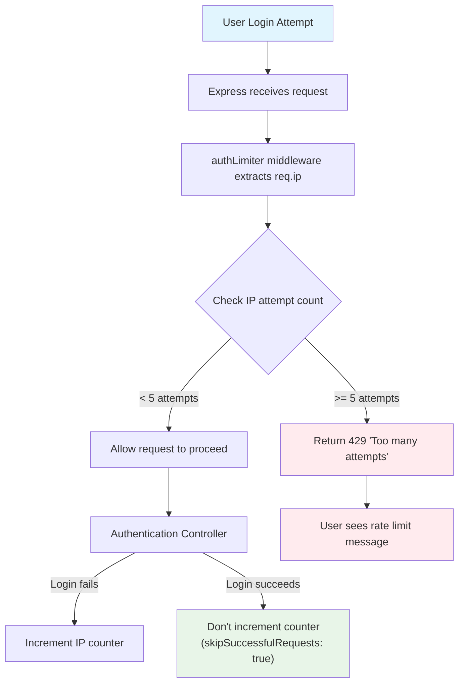

# IP Tracking and Rate Limiting Documentation

## Overview
This document explains how the "Too Many Requests" feature works in the authentication system, specifically how IP addresses are recorded and tracked after 5 wrong login attempts.

## System Architecture

### Rate Limiter Configuration
Located in: `/src/routes/index.js` (lines 7-14)

```javascript
const authLimiter = rateLimit({
  windowMs: 15 * 60 * 1000, // 15 minutes
  max: 5, // limit each IP to 5 login requests per windowMs
  message: {
    error: "Too many login attempts, please try again later."
  },
  skipSuccessfulRequests: true,
});
```

### Applied Endpoints
The `authLimiter` is applied to these authentication endpoints:
- `/api/auth` (login)
- `/api/register` 
- `/api/oauth/google`
- `/api/forgotPassword/email`
- `/api/forgotPassword/OTP`
- `/api/forgotPassword/password`

## IP Tracking Flow

The following diagram shows the complete flow of how IP addresses are tracked and rate limiting is applied:



> 📁 **Diagram Source**: The Mermaid source code for this diagram is available at [`docs/diagrams/ip-tracking-flow.mermaid`](./diagrams/ip-tracking-flow.mermaid)

### Flow Steps Explained:
1. **User Login Attempt** → Express receives request
2. **authLimiter middleware** extracts `req.ip` automatically
3. **Check IP attempt count** in memory store
4. **If < 5 attempts**: Allow request to proceed to Authentication Controller
5. **If >= 5 attempts**: Return 429 "Too many attempts" error
6. **On login failure**: Increment IP counter for future requests
7. **On login success**: Don't increment counter (due to `skipSuccessfulRequests: true`)

## How IP Recording Works

### 1. Automatic IP Detection
The `express-rate-limit` middleware automatically extracts IP addresses through:
- `X-Forwarded-For` header (when behind a proxy/load balancer)
- `X-Real-IP` header 
- `req.connection.remoteAddress` (direct connections)

### 2. In-Memory Storage
By default, stores IP attempts in memory using a Map-like structure:
```javascript
// Internal structure (simplified)
{
  "192.168.1.100": { count: 3, resetTime: 1704123456789 },
  "10.0.0.50": { count: 5, resetTime: 1704123456789 }
}
```

### 3. Key Configuration
- **`max: 5`** = Maximum 5 attempts per IP
- **`windowMs: 15 * 60 * 1000`** = 15-minute reset window
- **`skipSuccessfulRequests: true`** = Only failed attempts count

## Custom IP Tracking Examples

### Forgot Password Controller
Manual IP tracking implementation (lines 30-46):

```javascript
// Check rate limiting
const clientKey = `${req.ip}-${normalizedEmail}`;
const attemptData = resetAttempts.get(clientKey);

if (attemptData && attemptData.count >= MAX_ATTEMPTS) {
  const timeLeft = attemptData.lockedUntil - Date.now();
  if (timeLeft > 0) {
    return next(new AppError(
      `Too many password reset attempts. Try again in ${Math.ceil(timeLeft / 60000)} minutes.`,
      429
    ));
  }
}
```

## Rate Limiting Strategy

| Endpoint Type | Limit | Window | Description |
|---------------|-------|--------|-------------|
| General API | 100 requests | 15 minutes | Per IP |
| Auth Endpoints | 5 attempts | 15 minutes | Per IP |
| Password Reset | 3 attempts | 15 minutes | Per email |
| OTP Verification | 5 attempts | 30 minutes | Per email |

## Implementation Details

### Route Configuration
```javascript
// Authentication routes with rate limiting
router.use("/api/register", authLimiter, require("./auth/register"));
router.use("/api/oauth/google", authLimiter, require("./auth/oauth"));
router.use("/api/auth", authLimiter, require("./auth/auth"));
router.use("/api/forgotPassword/email", authLimiter, require("./auth/forgotPassword"));
router.use("/api/forgotPassword/OTP", authLimiter, require("./auth/matchOTP"));
router.use("/api/forgotPassword/password", authLimiter, require("./auth/passwordReset"));
```

### Middleware Chain
1. **Express.js** automatically populates `req.ip`
2. **express-rate-limit** middleware automatically stores IP + attempt counts
3. **No custom code needed** - handled by middleware internally

## Security Features

- ✅ **IP-based limiting** prevents brute force attacks
- ✅ **Automatic reset** after time window expires
- ✅ **Successful requests ignored** (skipSuccessfulRequests: true)
- ✅ **Consistent error messages** across all endpoints
- ✅ **Memory efficient** in-memory storage
- ✅ **Production ready** with proper headers

## Files Involved

| File | Purpose |
|------|---------|
| `/src/routes/index.js` | Rate limiter configuration and application |
| `/src/controllers/auth/authController.js` | Login logic (no IP handling needed) |
| `/src/controllers/auth/forgotPasswordController.js` | Custom IP+email tracking |
| `/src/controllers/auth/otpMatchController.js` | Custom email-based rate limiting |

---

**Note**: The "5 wrong attempts" limitation is controlled by the `max: 5` setting in the `authLimiter` configuration. The IP tracking is handled automatically by the express-rate-limit middleware.
